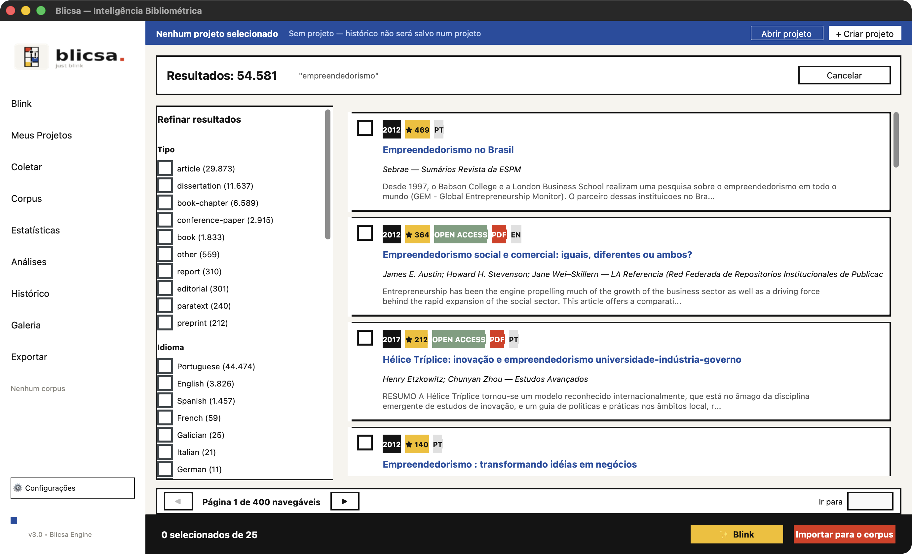

Desktop application for bibliometric network analysis and visualization, built with Python.  
Maps scientific literature into interactive networks to reveal research fronts, clusters, and knowledge gaps.


[](https://github.com/LeoPani/blicsa/actions/workflows/ci.yml)


[](https://doi.org/10.5281/zenodo.21866410)



## Documentation

| | |
|---|---|
| **[Overview](docs/index.md)** | what Blicsa is, who it is for, what it solves |
| **[Installation](docs/installation.md)** · *[pt-BR](docs/instalacao.md)* | Windows, macOS, Linux |
| **[Usage](docs/usage.md)** · *[pt-BR](docs/uso.md)* | full walkthrough with a reproducible sample dataset |
| **[Maps](docs/mapas.md)** | what each visualisation means and how to read it |
| **[Methods](docs/methods.md)** · *[pt-BR](docs/metodos.md)* | formulas and citations |
| **[Known limitations](docs/limitacoes.md)** | what Blicsa does *not* do |
| **[FAQ](docs/faq.md)** | including: does my data leave my machine? (no) |

---

## Features

### Data Import
- **Multi-source import**: Scopus CSV, Web of Science TXT, BibTeX, PubMed MEDLINE, OpenAlex JSON, Crossref JSON
- **Multi-file merging** with per-file format selection
- **Fuzzy deduplication** — 3-pass pipeline: DOI normalization → title similarity (≥ 93%) → (first author, year) matching
- **Drag-and-drop** file import
- **Thesaurus** for synonym normalization

### Network Types
| Map | Description |
|-----|-------------|
| Keyword Co-occurrence | Terms that appear together across papers |
| Co-authorship | Author collaboration network |
| Co-citation | References cited together |
| Bibliographic Coupling | Papers sharing references |
| Direct Citation | Paper-to-paper citation graph |
| IPC Co-classification | Patent subclass co-occurrence |

### Analysis
- **Louvain clustering** with automatic community detection
- **ForceAtlas2 layout** with optional LinLog mode
- **Association Strength normalization** and **TF-IDF relevance scoring**
- **Full / Fractional counting** methods
- **Temporal evolution** of the network across 5-year periods
- **Citation burst detection** — terms rising fastest in recent years
- **Network metrics**: diameter, average path length, clustering coefficient, density
- **Bradford's Law** — source dispersion by zone
- **Lotka's Law** — author productivity distribution
- **h-index** per author

### Visualization
- Dark-theme matplotlib canvas with:
  - Cluster-colored glow per node
  - Edge color blending between endpoint nodes
  - Label backgrounds tinted to cluster color
  - **Betweenness**, **PageRank**, **Degree**, **Year**, **KDE density** color modes
  - Click node → zoom + neighborhood highlight
  - Edge weight threshold slider
  - **Cluster filter** — show/hide individual clusters
- Interactive **Plotly HTML** map (CDN, no install needed)
- **Plotly density** contour map
- **Trend chart** — term frequency over time (multi-select, up to 14 terms)
- **Word cloud** from keywords or abstracts

### AI Integration
- **Groq API** (llama-3.3-70b-versatile) for:
  - Structured bibliometric insights (research fronts, gaps, recommendations)
  - Automatic semantic cluster labeling
- **Node info panel** — click any node to see: centrality metrics, co-occurring terms, related papers with citation counts

### Export
| Format | Content |
|--------|---------|
| PNG / SVG / PDF | High-res map image |
| Plotly HTML | Interactive standalone map |
| PyVis HTML | Force-directed interactive map |
| GML | Gephi / Cytoscape compatible |
| GEXF | Native Gephi format with attributes |
| Pajek .net | Pajek network format |
| JSON topology | Nodes + edges for D3.js / Cytoscape.js |
| CSV (nodes) | Rankings with betweenness, degree, relevance, year |
| CSV (edges) | Edge list with raw and normalized weights |
| Excel (.xlsx) | Rankings + edges + full dataframe in separate sheets |

### UX
- Save / load configuration as JSON
- Progress bar with status messages for all long operations
- Keyboard shortcuts: `Ctrl+G` generate · `Ctrl+I` AI insights · `Ctrl+E` export tab · `Ctrl+R`/`Esc` reset view
- Sortable ranking table (click any column header)
- Year filter, top-% relevance filter, extra stop words

---

## Releases & Standalone Binaries

Pre-compiled binaries are published automatically via GitHub Actions on every tagged release.
**No Python installation required.**

| Platform | Download | Notes |
|----------|----------|-------|
| **Windows** | [`Blicsa_Setup.exe`](https://github.com/LeoPani/blicsa/releases/latest) | Recommended — includes installer |
| **Windows** | [`Blicsa-windows-portable.zip`](https://github.com/LeoPani/blicsa/releases/latest) | Portable, extract and run |
| **macOS** | [`Blicsa.dmg`](https://github.com/LeoPani/blicsa/releases/latest) | Open and drag to Applications |
| **Linux** | [`Blicsa-x86_64.AppImage`](https://github.com/LeoPani/blicsa/releases/latest) | `chmod +x Blicsa-x86_64.AppImage` then run |

Download `CHECKSUMS.txt` alongside your file to verify integrity:

```bash
sha256sum -c CHECKSUMS.txt
```

> [!NOTE]
> **macOS Gatekeeper**: Builds are currently unsigned. First launch: right-click `Blicsa.app` → **Open** → **Open**.

---

## Installation

To run directly from source code:

```bash
git clone https://github.com/LeoPani/blicsa.git
cd blicsa
pip install -r requirements.txt
python main.py
```

> **Python 3.11+** is required. The pinned scientific stack (`numpy`, `pandas`, `scipy`,
> `networkx`) declares `requires-python >=3.11`, so 3.10 cannot resolve the dependencies.

---

## Quick Start

1.  **Import & Online Search**: Add bibliometric files using **➕ Adicionar** in the **Data Import** tab, or query **OpenAlex / Crossref / PubMed** directly inside the **Busca Online** panel.
2.  **Deduplicate**: Click **🔍 Deduplicar** to review and filter duplicate documents.
3.  **Clustering & Layout**: Select your mapping configurations, including **Louvain** or **Leiden** community clustering and **Resolução Cluster** slider.
4.  **Redraw / Explore**: Click **Gerar Mapa** (`Ctrl+G`). Hovering over a node highlights all connected nodes in their cluster color, fading other elements to 15% opacity.
5.  **AI Insights**: Configure your AI provider settings (Preset models for Groq, OpenAI, OpenRouter, or local Ollama) in the sidebar, input your **Chave API**, and click **Nomear Clusters** or **Insights com IA**.
6.  **Save & Export**: Use the **Exportar** tab to save your complete project in `.blicsa` zip format or export graph networks in Gephi (GEXF) and VOSviewer (Map/Net txt) formats.

---

## Project Structure

```
blicsa/
├── main.py                  # CustomTkinter GUI wrapper
├── Blicsa.spec              # PyInstaller spec file for multi-target packaging
├── core/
│   ├── parsers.py           # Multi-source parsers & merging
│   ├── matrix_builders.py   # Co-occurrence matrices, Leiden/Louvain, & VOSviewer
│   ├── visualizer.py        # Plotly graph and map visualizations
│   ├── nlp.py               # Stopwords, n-grams, and burst detection
│   ├── sources/             # OpenAlex, Crossref, and PubMed API search providers
│   ├── project.py           # .blicsa project save/load manager
│   └── i18n.py              # System language detector (PT-BR / EN default)
├── ai/
│   └── client.py            # Generic OpenAI-compatible AI API client
├── locales/
│   ├── en.json              # English catalog (default)
│   └── pt_BR.json           # Portuguese (Brazil) catalog
├── paper/
│   ├── paper.md             # JOSS publication skeleton
│   └── paper.bib            # Bibliography file
└── requirements.txt
```

---

## How to cite

Use the **Cite this repository** button on GitHub, which reads `CITATION.cff`, or:

> Paniago, L. (2026). *Blicsa* (version 2.0.0) [Computer software].
> https://github.com/LeoPani/blicsa

Once the archival DOI is issued, cite the DOI instead — it is the stable identifier and
resolves to a fixed snapshot, while the repository URL follows the moving branch.

## Security

Found a vulnerability? Please **do not open a public issue** — see [`SECURITY.md`](SECURITY.md)
for the reporting policy, scope and response times. That file also documents what Blicsa does
with your data: the corpus stays on your machine, and the AI key goes to the operating system
keychain, never to the repository or the project file.

## License

MIT License — see [`LICENSE`](LICENSE).
