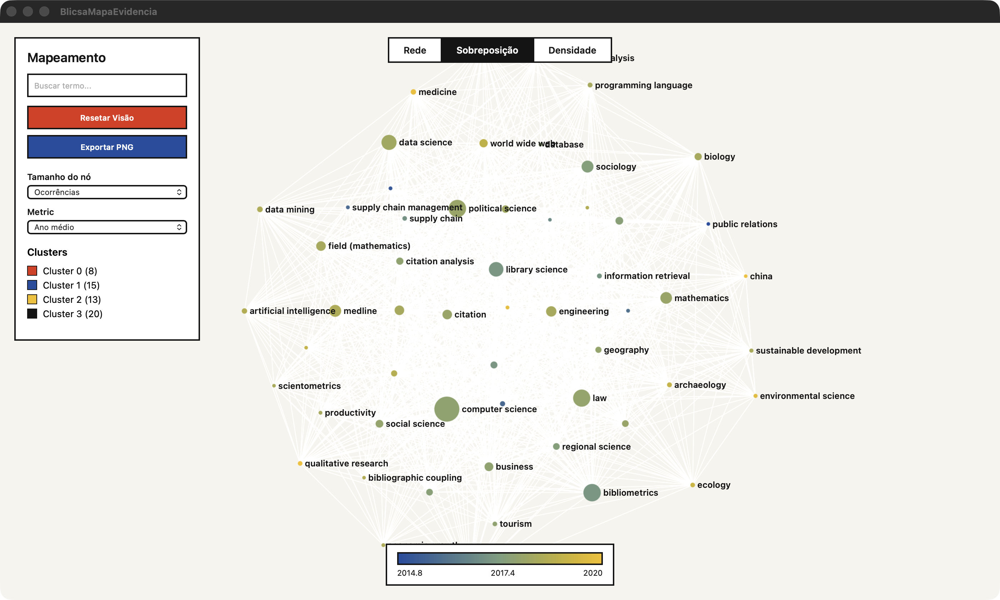
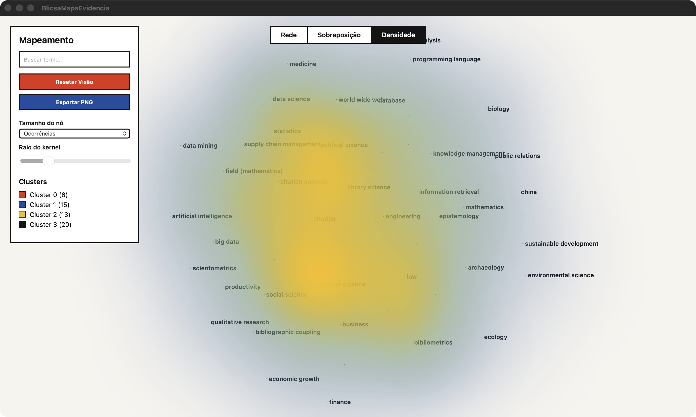
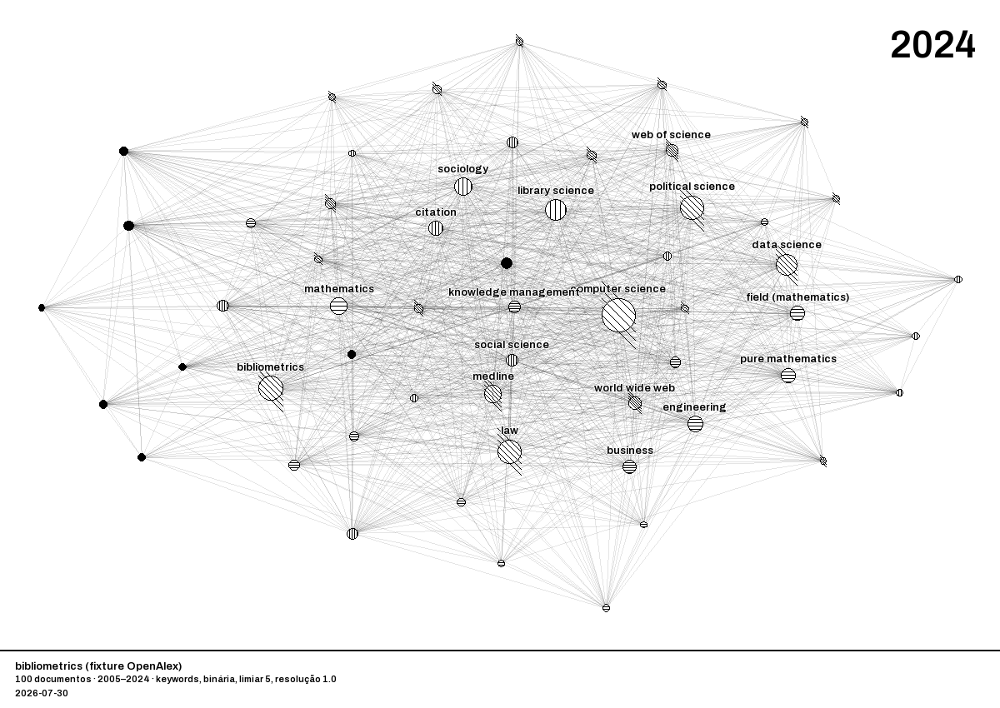

# Mapas — o que cada visualização significa

As três visualizações usam **a mesma rede** e o **mesmo layout**. O que muda é o que a cor
codifica. Trocar de visualização não recalcula nada: os nós não se movem.

---

## Rede — quais temas andam juntos

- **Nó** = um termo. **Tamanho** = quantos documentos o contêm.
- **Aresta** = coocorrência. **Espessura** = força de associação.
- **Cor** = cluster (comunidade detectada pelo Louvain).
- **Proximidade** = termos próximos coocorrem mais.

**Como ler:** cada cor é um subtema. Termos na fronteira entre duas cores são pontes — com
frequência os mais interessantes, porque conectam literaturas que costumam ser lidas em
separado.

## Overlay — quando cada tema aconteceu

Mesma rede, mas a cor passa a codificar o **ano médio de publicação** dos documentos em que o
termo aparece. A **barra de gradiente** na lateral dá a escala.

**Como ler:** o gradiente é a única escala contínua do app — tudo mais é chapado, justamente
para que ele se destaque. Termos na ponta recente do gradiente são **tendência**: apareceram
sobretudo nos últimos anos. Termos na ponta antiga são temas consolidados ou em declínio.

**Cuidado:** ano médio alto não significa "importante", significa "recente". Um termo com ano
médio 2023 e três ocorrências é ruído, não tendência. Cruze sempre com o tamanho do nó.

## Densidade — onde a literatura se concentra

Um campo contínuo: cada ponto do plano recebe intensidade conforme a proximidade e o peso dos
termos ao redor.

**Como ler:** áreas quentes são regiões densamente povoadas — subcampos maduros, com muitos
termos fortemente conectados. Áreas frias com poucos nós isolados podem indicar temas
periféricos ou emergentes. É a visualização mais útil para achar **lacunas**: regiões vazias
entre duas áreas quentes sugerem literaturas que não conversam.

---

## Controles de qualidade

O mapa bruto costuma ser ilegível. Estes controles é que o tornam interpretável.

### Ocorrência mínima

Descarta termos que aparecem em menos de *N* documentos. É o controle de maior efeito: um
corpus de 2.000 registros gera dezenas de milhares de termos, quase todos irrelevantes.
Comece em 5 e ajuste.

### Relevância de termos

Mantém os termos mais **específicos** do corpus e descarta os genéricos (`estudo`, `análise`).
A métrica usa divergência KL e **não é comparável à do VOSviewer** — veja
[métodos](metodos.md).

### Resolução do clustering

Controla a granularidade do Louvain. Maior = mais clusters, menores e mais específicos.
Menor = menos clusters, mais amplos. Não existe valor certo: 1,0 é um ponto de partida, e a
escolha faz parte da interpretação.

### Atração e repulsão

Parâmetros do ForceAtlas2. Mais repulsão espalha o grafo e separa comunidades; mais atração o
compacta. **Não mudam a estrutura** — só a legibilidade.

### Thesaurus

Unifica variantes num termo canônico: `inovacao`, `innovation` e `Inovação` viram uma coisa só.
É o controle mais trabalhoso e o que mais melhora o resultado, especialmente em corpora em
português, onde a extração automática erra mais.

### Período

Recorta o corpus por ano antes de montar a rede. Útil para comparar fatias temporais.

---

## Animação temporal

Mostra a rede evoluindo por janelas de tempo: o que surge, o que cresce, o que some. Exporta
em GIF.

## Exportação

| formato | serve para |
|---|---|
| **PNG** | figura de artigo — inclui modo pôster e tema de impressão em alto contraste |
| **HTML** | mapa interativo, abre em qualquer navegador, funciona offline |
| **GIF** | a animação temporal |
| **GML** | abrir a rede no Gephi ou no VOSviewer |

