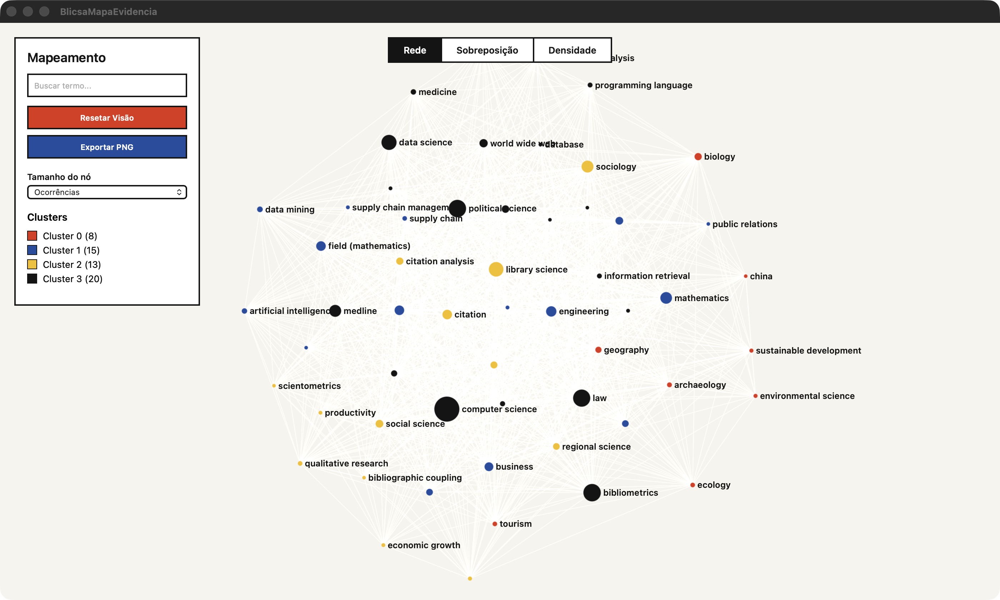
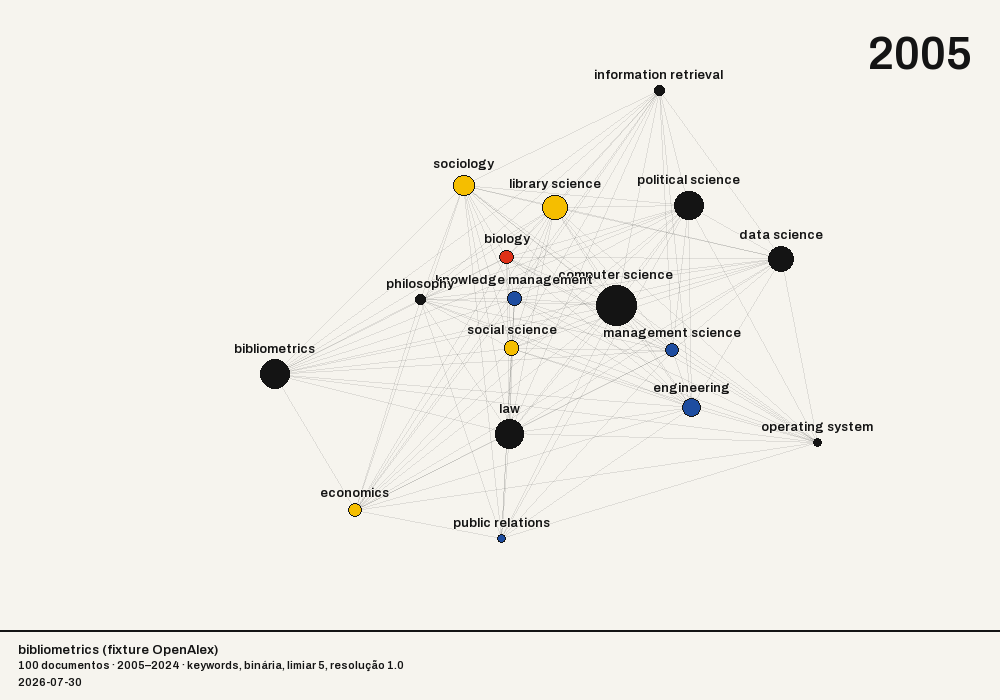

# Uso — do primeiro termo ao mapa exportado

*English version: [usage.md](usage.md)*

Este guia percorre o fluxo inteiro. Para reproduzir sem depender de rede, use
**`docs/sample_dataset.csv`** — 200 registros reais sobre *bibliometric analysis*, colhidos do
OpenAlex, com as 13 colunas do schema do Blicsa.

---

## 1. Criar um projeto (recomendado)

Sem projeto o Blicsa funciona, mas nada fica registrado: buscas, corpus e mapas se perdem ao
fechar. Com projeto, tudo vira um arquivo `.blicsa` que você pode guardar, versionar e reabrir.

**Meus Projetos → + Criar projeto** → dê um nome.

A faixa azul no topo mostra o projeto aberto. Sem projeto, ela avisa: *"Sem projeto — histórico
não será salvo num projeto"*.

## 2. Buscar

**Coletar → Termo / Query**, escolha a base (OpenAlex, Crossref ou PubMed) e clique
**🔍 Buscar**.

O que aparece na hora:

- **Resultados: 54.581** — o total **real** da base, não quantos foram baixados;
- **a primeira página** (25 registros) — só ela foi baixada;
- **Refinar resultados** — as facetas, com as contagens do universo inteiro.

Nada mais foi transferido. Navegar entre páginas baixa uma página por vez.

### O campo Qtd

Define quantos registros a **importação** vai trazer. **Vazio significa ilimitado** — todos os
registros que casarem. Não há teto escondido: a proteção contra baixar mais do que você queria
é o aviso de volume, que mostra o total e deixa você escolher.

## 3. Refinar por facetas

Marque valores em **Tipo**, **Idioma**, **Ano**, **Acesso aberto**, **Fonte** ou **Autor**.

- **Dentro da mesma categoria vale OU**: marcar `article` e `book-chapter` traz os dois.
- **Entre categorias vale E**: `article` + `Portuguese` traz artigos em português.

Cada filtro ativo vira um *chip* acima da lista; o **✕** do chip o remove. As contagens das
outras categorias se atualizam, mas **a categoria que você está filtrando continua mostrando
todas as suas opções** — do contrário, marcar `article` faria `book-chapter` sumir e você
ficaria preso ao próprio filtro.

## 4. Importar para o corpus

Marque registros individualmente e clique **Importar para o corpus**, ou importe o conjunto
inteiro da busca. Aí sim há download em massa, e o app avisa o volume antes.

**Alternativa sem rede:** **Coletar → Importar arquivo** e escolha
`docs/sample_dataset.csv` (ou uma exportação sua do Scopus/Web of Science em CSV, BibTeX ou
texto). É o caminho reproduzível para seguir este guia sem depender de API.

### Deduplicação

Ao juntar buscas de bases diferentes, o mesmo artigo aparece mais de uma vez. O Blicsa marca os
duplicados por DOI e, quando não há DOI, por título normalizado + ano. Você vê a prévia antes
de aplicar.

## 5. Gerar o mapa

**Análises → Mapa & IA**. Escolha:

| controle | o que faz |
|---|---|
| **Tipo de mapa** | rede, overlay ou densidade — veja [mapas.md](mapas.md) |
| **Campo** | de onde vêm os termos: palavras-chave, títulos, resumos ou títulos+resumos |
| **Ocorrência mínima** | descarta termos que aparecem em poucos documentos |
| **Relevância** | mantém os termos mais específicos do corpus |
| **Resolução do clustering** | mais alta = mais clusters, menores |
| **Atração / Repulsão** | espalhamento do layout |
| **Thesaurus** | unifica variantes (`inovacao` → `inovação`) |
| **Período** | recorta por ano |

Clique **Gerar**.

## 6. Análises

**Estatísticas** e **Análises** trazem produção por ano, autores e fontes mais frequentes,
leis de Bradford e Lotka, e detecção de *bursts*. O que cada número significa está em
[metodos.md](metodos.md).

## 7. Exportar

**Exportar** oferece:

- **corpus** em CSV, Excel ou BibTeX;
- **mapa** em PNG (inclusive em modo pôster e tema de impressão) e HTML interativo;
- **animação temporal** do mapa em GIF;
- **rede** em GML, para abrir no Gephi ou no VOSviewer.

## 8. Salvar o projeto

**Meus Projetos → Salvar**. O `.blicsa` guarda corpus, mapa, posições do layout, rótulos de
cluster, histórico de buscas e todos os parâmetros. Reabrir devolve exatamente o mesmo estado.

> **Projetos salvos antes da v2.0** podem apresentar **clusterização diferente** da original ao
> serem reabertos: até a v2.0 a ordem de inserção dos nós não era determinística, e o Louvain
> podia chegar a uma partição distinta com a mesma entrada. A partir da v2.0 o resultado é
> reproduzível. O corpus e as métricas não mudam — só o agrupamento pode diferir.

## 9. Explorar a partir de um artigo

Na aba **Coletar**, botão **Explorar a partir de um artigo…**. Cole o DOI (ou o link do
OpenAlex) de um ou mais artigos que você já sabe que são centrais e clique em **Explorar**.

O Blicsa reúne, pelo OpenAlex, as referências desses artigos, os trabalhos mais citados que os
citam e os artigos que o próprio OpenAlex considera relacionados. Entre esses candidatos, fica
com os mais parecidos com os seus artigos de partida. Dois artigos são parecidos quando citam
as mesmas obras (acoplamento bibliográfico) ou quando são citados juntos (cocitação).

O resultado tem três listas:

- **No grafo**: os artigos mais parecidos. **Abrir mapa** mostra o grafo (tamanho = citações,
  cor = cluster; o modo Sobreposição colore por ano).
- **Obras anteriores**: o que esse grupo mais cita e não está no grafo. Costumam ser os clássicos.
- **Obras derivadas**: trabalhos que citam vários artigos do grafo. Costumam ser revisões e o
  estado da arte posterior.

Marque o que interessar e clique em **Adicionar marcados ao corpus**. Artigos que já estão no
corpus não entram de novo.

## 10. Baixar os PDFs de acesso aberto

Na aba **Corpus**, botão **Baixar PDFs abertos**. Escolha a pasta e clique em **Baixar**. O
Blicsa procura uma versão aberta e legal de cada artigo (Unpaywall, OpenAlex, arXiv e a página
do editor) e só grava o que for PDF de verdade. Artigos fechados não são baixados: o relatório
`blicsa_pdfs_relatorio.csv`, na mesma pasta, lista cada um com o link para você tentar pelo
acesso da universidade. Rodar de novo na mesma pasta não baixa outra vez o que já está lá.

## 11. Formatos de importação

Como exportar de cada base, o que o Blicsa lê de cada formato e qual mapa funciona com cada
um: [GUIA-IMPORTACAO.md](GUIA-IMPORTACAO.md).
